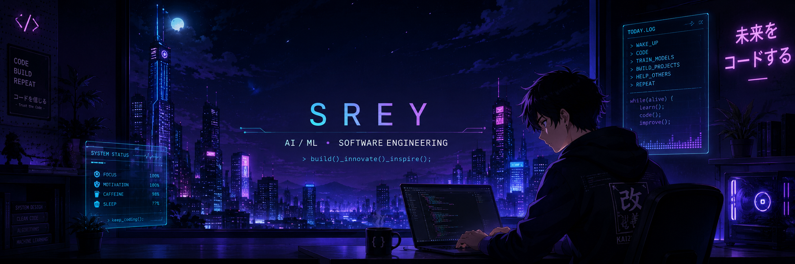
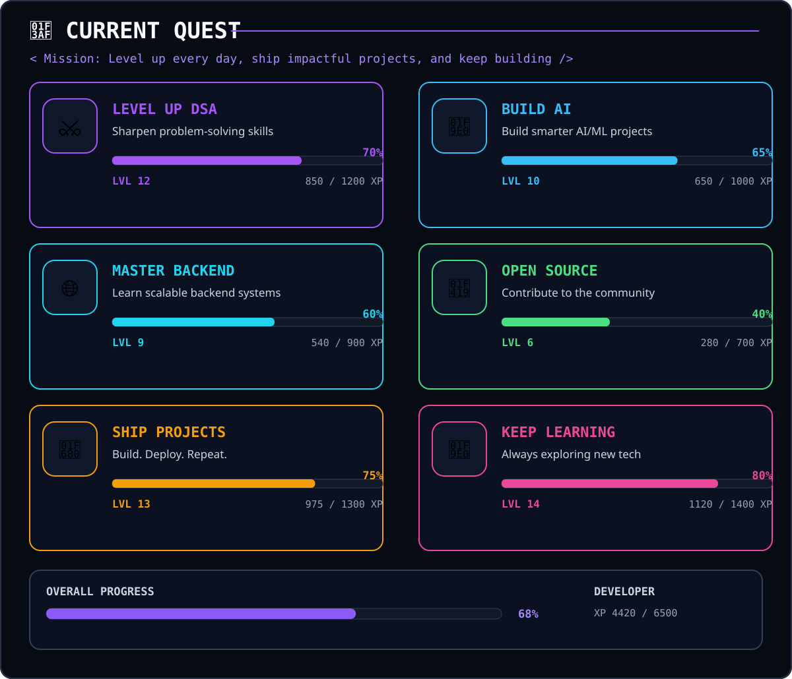

  

<h1 align="center">
  SREY
</h1>

  <code>AI / ML</code>
  &nbsp;&nbsp;•&nbsp;&nbsp;
  <code>SOFTWARE ENGINEERING</code>
  &nbsp;&nbsp;•&nbsp;&nbsp;
  <code>BACKEND</code>

  

  <a href="mailto:shwetanjsrey20@gmail.com">EMAIL</a>
  &nbsp;&nbsp;•&nbsp;&nbsp;
  <a href="https://www.linkedin.com/in/shwetanj-srey-6682603a0">LINKEDIN</a>
  &nbsp;&nbsp;•&nbsp;&nbsp;
  <a href="#">PORTFOLIO</a>

---

<h2 align="center">
  <code>ABOUT / SREY</code>
</h2>

  Computer Science graduate focused on building practical software,
  intelligent applications and scalable backend systems.

  My interests sit at the intersection of
  <b>Artificial Intelligence</b>, <b>NLP</b>,
  <b>Machine Learning</b> and <b>Software Engineering</b>.

  I enjoy taking an idea from
  <code>concept</code>
  →
  <code>implementation</code>
  →
  <code>deployment</code>.

  Currently improving my DSA fundamentals, exploring scalable systems
  and building projects that are actually worth putting online.

---

<h2 align="center">
  <code>TECH / STACK</code>
</h2>

<h3 align="center">LANGUAGES</h3>

  
  

<h3 align="center">AI / MACHINE LEARNING</h3>

  
  
  
  
  

<h3 align="center">BACKEND</h3>

  

<h3 align="center">TOOLS / INFRASTRUCTURE</h3>

  

---

<h2 align="center">
  <code>SELECTED / PROJECTS</code>
</h2>

<table>
<tr>

<td width="50%" valign="top">

<h3>MindWatch</h3>

AI-powered mental health risk detection and emotional trend analysis using NLP and transformer-based models.

  

<code>Python</code>
<code>PyTorch</code>
<code>Hugging Face</code>
<code>Flask</code>

  

</td>

<td width="50%" valign="top">

<h3>Scalable WebSockets</h3>

Real-time messaging system focused on scalable backend architecture and WebSocket communication.

  

<code>TypeScript</code>
<code>Node.js</code>
<code>WebSockets</code>

  

</td>

</tr>

<tr>

<td width="50%" valign="top">

<h3>NST Web</h3>

Flask-based Neural Style Transfer application combining the content of one image with the artistic style of another.

  

<code>Python</code>
<code>Flask</code>
<code>PyTorch</code>

  

</td>

<td width="50%" valign="top">

<h3>Habit Tracker</h3>

A habit-tracking application focused on helping users organize routines, monitor consistency and build better habits.

  

<code>Project in progress</code>

  

</td>

</tr>
</table>

---

<h2 align="center">
  <code>CURRENT / QUEST</code>
</h2>

  

---

<h2 align="center">
  <code>GITHUB / ACTIVITY</code>
</h2>

  

---

<h2 align="center">
  <code>BEYOND / CODE</code>
</h2>

<table>
<tr>

<td align="center" width="25%">

<h3>ANIME</h3>

Stories, characters and worlds that inspire me.

</td>

<td align="center" width="25%">

<h3>GAMING</h3>

Competitive games and exploring new worlds.

</td>

<td align="center" width="25%">

<h3>EXPERIMENTS</h3>

Building random things just to see if they work.

</td>

<td align="center" width="25%">

<h3>CURIOSITY</h3>

Always exploring something new.

</td>

</tr>
</table>

---

<h2 align="center">
  <code>CONNECT / WITH / ME</code>
</h2>

<table align="center">
  <tr>
    <td align="center">
      
    </td>

    <td align="center">
      
    </td>

    <td align="center">
      
    </td>
  </tr>
</table>

  Building things, learning continuously, and shipping when possible.

